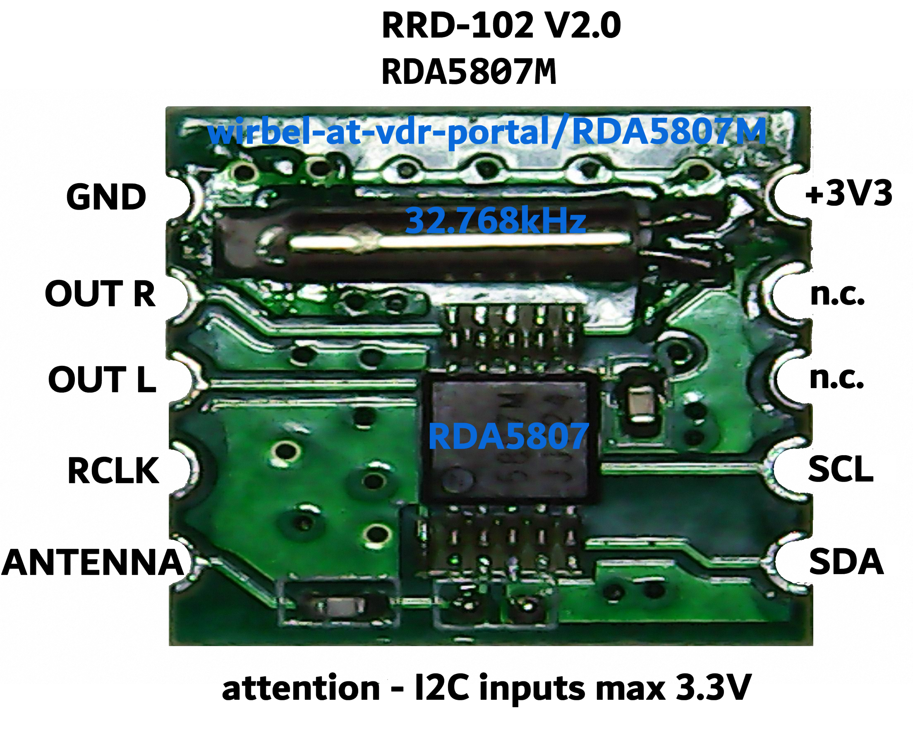
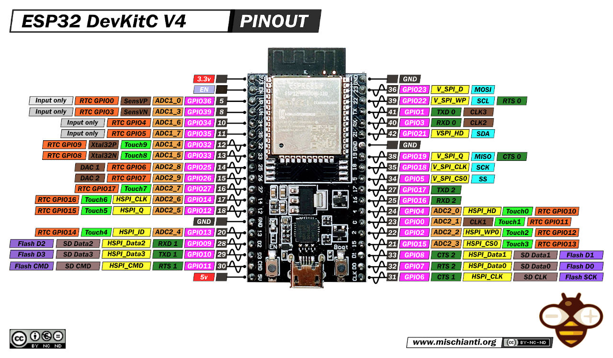
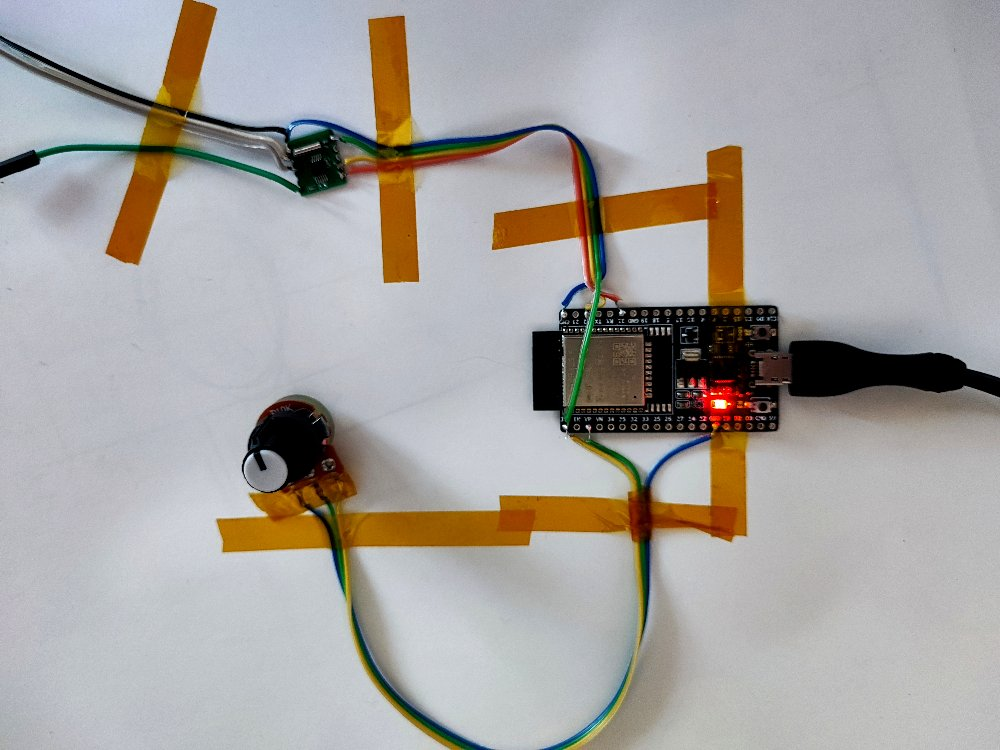

# RDA5807M
Arduino library for FM radio tuner RDA5807M.
Please note the small PCB size, 11.1mm x 12.6mm only.

## Connections

_NOTE: If your µC runs at more than 3.3volts, you need an level shifter._

### ESP32 DevKitC

#### Potentiometer 10k lin
- 1->GND
- 2->VP (Arduino:A0)
- 3->3V3

#### RDA5807M to ESP32
- VCC->3V3
- GND->GND
- SCL(SCLK)->22 (Arduino:SCL)
- SDA(SDIO)->21 (Arduino:SDA)

The radio chip should show up as 7-bit address 0x10 (0010000b).
Use i2detect to check for correct I2C communication.

#### Test setup
